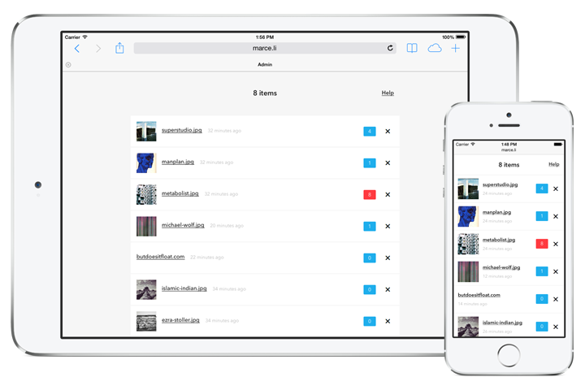
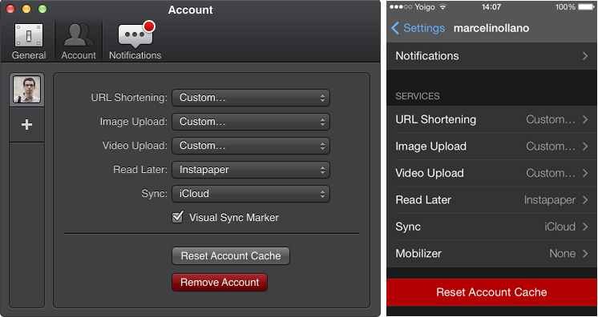

Endpoint
========

Endpoint is a humble [Tweetbot](http://tapbots.com) companion. It is close to a [CloudApp](http://getcloudapp.com) or [Droplr](http://droplr.com) replacement, but not quite. It is also the result of my frustration with other services that no longer allow for geeky features because they go mainstream (and good for them!). If you love hacking your own tools this may be for you.



How to Install
--------------

You will need to install [Ruby 2.1.2](http://ruby-lang.org), [Bundler](bundler.io) and [SQLite](https://en.wikipedia.org/wiki/SQLite). Other than that it is all pretty simple:

1. `cp .env-example .env` and customize the `.env` file.
2. `bundle install` to install all the missing gems.
3. `rackup -p 9292` to start the local server.

You can load some sample files from `/test/fixtures` with:

```
RACK_ENV=development SHORT=http://127.0.0.1:9292 ./bin/seed
```

Visit `/admin` to check the Admin and the help section. Looks like this:


Production Setup
----------------

I found that I enjoy running a VPS and is great for projects like this that need to have a fast response time with long idle times in between. [Heroku](http://heroku.com) is great but is quite expensive for my needs and I hate that I can't write to the file system. I don't want to use [Amazon S3](http://aws.amazon.com) to serve the files either.

I use [DigitalOcean](http://digitalocean.com), but [Linode](http://linode.com) is great too. I deploy using [nginx](http://nginx.org) and [Passenger](https://www.phusionpassenger.com) with this:

```
server {
  server_name exam.pl;
  listen 80;
  root /<PATH>/public;
  client_max_body_size 500M;
  passenger_enabled on;

  access_log /<PATH>/log/access.log;
  error_log  /<PATH>/log/error.log;
}
```

If you still want to deploy to Heroku you will need to change the database string inside `app.rb` to something instead of SQLite and update the `Gemfile`. Then you will need to find a way to upload to Amazon S3 or wherever you want. I won't be doing this, but you can fork the repo.

Using the API
-------------

The API is really minimal. You have a single URL to query with three different request methods: `GET`, `POST`, `DELETE`. For each method the API takes different params, but all are pretty much the same. 

The API follows a design methodology that I call: It's your fault(TM). This means that you will get pretty much a `Bad Request` for any request that it is not valid but also if the request is valid but throws an error on the server. I know, I know, it sounds really bad, but the API is so small that it doesn't bother me.

### Shorten URLs

```
curl -X GET "http://exam.pl/api?token={token}&url={url}&slug={slug}"
```

- **token** (required): This is how you authenticate, use a long hash in `.env`.
- **url** (required): The URL that you want to get shortened.
- **slug** (optional): You can override the random slug of the shortened link.

### Share Files

```
curl -X POST --form "media=@{file}" "http://exam.pl/api?token={token}&slug={slug}"
```

- **token** (required): This is how you authenticate, use a long hash in `.env`.
- **file** (required): The file that you want to upload for sharing.
- **slug** (optional): You can override the random slug of the shortened link.

### Delete URLs or Files

```
curl -X DELETE "http://exam.pl/api?token={token}&slug={slug}"
```

- **token** (required): This is how you authenticate, use a long hash in `.env`.
- **slug** (required): The slug of the URL or file that you want to delete.

Tweetbot Setup
--------------

I love Tweetbot, it is solid and fun to use. The main goal of this project was to have a service to use with Tweetbot. To setup Tweetbot you have to go to `Admin > Help` in Endpoint. You will see a bunch of URLs that you need to copy into Tweetbot. 

Go to  `Settings > Account` in Tweetbot, select `Custom` for each type and paste the URLs:



Now, share a link, an image or a video and Tweetbot will post the shortened URL and upload the file to your server. Keep in mind that Tweetbot will not just upload any file (e.g. it only uploads `.mp4` for video).

Twitter Cards
-------------

This is how Twitter is rollin'. Simple text tweets are out, rich format tweets are in. If it looks like Facebook to you, well, it is quite a bit like that. I included a sample photo card because I can imagine Tweetbot using this card thing in the future.

Endpoint has two types of short links. For example, let's say you share a `.png` image and  Endpoint returns the slug `1234`. If you visit `http://exam.pl/1234.png` you will get the source file. If you visit `http://exam.pl/1234` you will get a preview page with the Twitter card.

If you want Twitter to display that card you still need to whitelist your domain going to the [Twitter Card Validator](https://cards-dev.twitter.com/validator), submit a link with a card, apply for whitelisting and wait. So much fun! **#nope**.

Purge Script
------------

I use Twitter as a communication tool, not like a blog. When I closed my CloudApp account I discovered tons of files that I forgot about and had sensible information. I just did not delete them and kept piling up as the time passed. It took me a custom script and quite a while to delete all files.

This time I wanted to automate a way to remove files that were already shared as a security precaution. The purge script inside of the `bin` folder does just that:

```
RACK_ENV=production ./bin/purge
```  

You can create a Crontab task to run daily with `sudo crontab -e` on your server:

```
0 0 * * * RACK_ENV=production /<PATH>/bin/purge
```  

In the `.env` file you can specify how many days into the past you want to keep the files. For example, if you want to keep files for a month set the environment variable to `PURGE=30`.

Using a Folder
--------------

This is pretty cool. I couldn't do this with other services. Long story short (pun intended) my short URL is `http://marce.li` but my name is Marceli**no**. I tried buying `http://marceli.no` but Norway only allows to register `.no` domains to Norwegians. I wanted to use something like `http://marce.li/no` instead just for fun.

If you want to do something similar take a look to `config.ru`. There is help to roll your own domain plus folder short link. You will need to uncomment `rack-rewrite` line in the `Gemfile` too and run `bundle install` again.

Testing
-------

I wrote some tests to be sure that everything is working. I use a black box approach, I throw requests to the API and check for the right response. I have very little Javascript and it is untested, but looks like it works.

You can run the test suite issuing the following command:

```
bundle rake
```

The tests cover the bare minimum and some of them are brittle. If for some reason you have to clean previous tests' leftovers, there is a command for that:

```
bundle rake clean
```

Conclusions
-----------

There is so much more that could be done here. I would love to have better templates and design, some branding for the app, a way to upload files directly from the Admin or a native desktop client. But for now the app does just what I need.

If I were to make this into some multi-tenant web service I would probably use Rails instead of Sinatra because I see how this could turn into Mordor pretty fast. I would also try to reply requests with more info to make it easier to debug. But if I ever want that I guess I could pay a third-party and use some custom scripts to get me pretty close to this.

Anyway, I really enjoyed starting with some simple queries in the Terminal to having a fleshed out sharing web service that I can use with Tweetbot. I hope you enjoy it too!

License
-------

You can do whatever you want, but Tweetbot, CloupApp, Droplr and any other trademarks mentioned here are copyright of their respective owners. I used all of them in the past and I loved them. 

Give them a try too!
